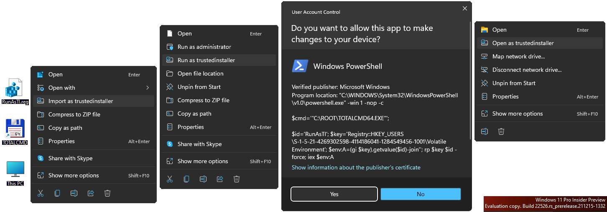
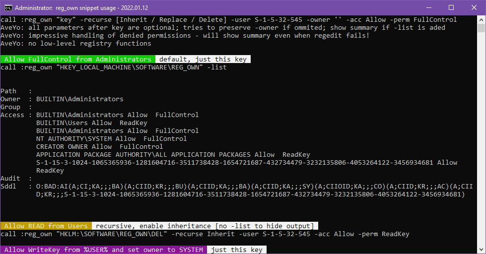
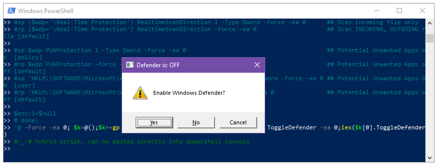

  

RunAsTI - TrustedInstaller access rights while keeping HKCU loaded  
---  
*supports Windows 7 - Windows 10 - Windows 11 release - Windows 11 dev*  

#### [RunAsTI.reg](RunAsTI.reg) context menu for folders, exe, msc, bat, cmd, reg - updated 2023.07.06  
```reg
Windows Registry Editor Version 5.00

; Context Menu entries to use RunAsTI - lean and mean snippet by AveYo, 2018-2023
; [FEATURES]
; - innovative HKCU load, no need for reg load / unload ping-pong; programs get the user profile
; - sets ownership privileges, high priority, and explorer support; get System if TI unavailable
; - accepts special characters in paths for which default run as administrator fails
; - show on the new 11 contextmenu via whitelisted id; plenty other available, fuck needing an app!
; 2022.04.07: PowerShell / Terminal here (if installed, use Terminal as TI, else use PowerShell as TI)
; 2023.07.06: fix arguments with quotes

[-HKEY_CLASSES_ROOT\RunAsTI]
[-HKEY_CLASSES_ROOT\batfile\shell\setdesktopwallpaper]
[-HKEY_CLASSES_ROOT\cmdfile\shell\setdesktopwallpaper]
[-HKEY_CLASSES_ROOT\exefile\shell\setdesktopwallpaper]
[-HKEY_CLASSES_ROOT\mscfile\shell\setdesktopwallpaper]
[-HKEY_CLASSES_ROOT\Microsoft.PowerShellScript.1\shell\setdesktopwallpaper]
[-HKEY_CLASSES_ROOT\regfile\shell\setdesktopwallpaper]
[-HKEY_CLASSES_ROOT\Folder\shell\setdesktopwallpaper]
[-HKEY_CLASSES_ROOT\Directory\background\shell\extract]
; To remove entries, copy paste above into undo_RunAsTI.reg file, then import it

; RunAsTI on .bat
[HKEY_CLASSES_ROOT\batfile\shell\setdesktopwallpaper]
"MUIVerb"="Run as trustedinstaller"
"HasLUAShield"=""
"Icon"="powershell.exe,0"
[HKEY_CLASSES_ROOT\batfile\shell\setdesktopwallpaper\command]
@="C:\\Windows\\System32\\WindowsPowerShell\\v1.0\\powershell.exe -win 1 -nop -c iex((10..40|%%{(gp 'Registry::HKCR\\RunAsTI' $_ -ea 0).$_})-join[char]10); # --%% \"%L\""

; RunAsTI on .cmd
[HKEY_CLASSES_ROOT\cmdfile\shell\setdesktopwallpaper]
"MUIVerb"="Run as trustedinstaller"
"HasLUAShield"=""
"Icon"="powershell.exe,0"
[HKEY_CLASSES_ROOT\cmdfile\shell\setdesktopwallpaper\command]
@="C:\\Windows\\System32\\WindowsPowerShell\\v1.0\\powershell.exe -win 1 -nop -c iex((10..40|%%{(gp 'Registry::HKCR\\RunAsTI' $_ -ea 0).$_})-join[char]10); # --%% \"%L\""

; RunAsTI on .exe
[HKEY_CLASSES_ROOT\exefile\shell\setdesktopwallpaper]
"MUIVerb"="Run as trustedinstaller"
"HasLUAShield"=""
"Icon"="powershell.exe,0"
[HKEY_CLASSES_ROOT\exefile\shell\setdesktopwallpaper\command]
@="C:\\Windows\\System32\\WindowsPowerShell\\v1.0\\powershell.exe -win 1 -nop -c iex((10..40|%%{(gp 'Registry::HKCR\\RunAsTI' $_ -ea 0).$_})-join[char]10); # --%% \"%L\""

; RunAsTI on .msc
[HKEY_CLASSES_ROOT\mscfile\shell\setdesktopwallpaper]
"MUIVerb"="Run as trustedinstaller"
"HasLUAShield"=""
"Icon"="powershell.exe,0"
[HKEY_CLASSES_ROOT\mscfile\shell\setdesktopwallpaper\command]
@="C:\\Windows\\System32\\WindowsPowerShell\\v1.0\\powershell.exe -win 1 -nop -c iex((10..40|%%{(gp 'Registry::HKCR\\RunAsTI' $_ -ea 0).$_})-join[char]10); # --%% \"%L\""

; RunAsTI on .ps1
[HKEY_CLASSES_ROOT\Microsoft.PowerShellScript.1\shell\setdesktopwallpaper]
"MUIVerb"="Run as trustedinstaller"
"HasLUAShield"=""
"Icon"="powershell.exe,0"
[HKEY_CLASSES_ROOT\Microsoft.PowerShellScript.1\shell\setdesktopwallpaper\command]
@="C:\\Windows\\System32\\WindowsPowerShell\\v1.0\\powershell.exe -win 1 -nop -c iex((10..40|%%{(gp 'Registry::HKCR\\RunAsTI' $_ -ea 0).$_})-join[char]10); # --%% powershell -nop -c iex((gc -lit '%L')-join[char]10)"

; RunAsTI on .reg
[HKEY_CLASSES_ROOT\regfile\shell\setdesktopwallpaper]
"MUIVerb"="Import as trustedinstaller"
"HasLUAShield"=""
"Icon"="powershell.exe,0"
[HKEY_CLASSES_ROOT\regfile\shell\setdesktopwallpaper\command]
@="C:\\Windows\\System32\\WindowsPowerShell\\v1.0\\powershell.exe -win 1 -nop -c iex((10..40|%%{(gp 'Registry::HKCR\\RunAsTI' $_ -ea 0).$_})-join[char]10); # --%% regedit /s \"%L\""

; RunAsTI on Folder
[HKEY_CLASSES_ROOT\Folder\shell\setdesktopwallpaper]
"MuiVerb"="Open as trustedinstaller"
"HasLUAShield"=""
"Icon"="powershell.exe,0"
"AppliesTo"="NOT System.ParsingName:=\"::{645FF040-5081-101B-9F08-00AA002F954E}\""
[HKEY_CLASSES_ROOT\Folder\shell\setdesktopwallpaper\command]
@="C:\\Windows\\System32\\WindowsPowerShell\\v1.0\\powershell.exe -win 1 -nop -c iex((10..40|%%{(gp 'Registry::HKCR\\RunAsTI' $_ -ea 0).$_})-join[char]10); # --%% \"%L\""

; Open Terminal or Powershell as trustedinstaller here - can spawn another terminal with: cmd /c $env:wt
[HKEY_CLASSES_ROOT\Directory\background\shell\extract]
"MuiVerb"="PowerShell / Terminal"
"HasLUAShield"=""
"NoWorkingDirectory"=""
"Position"=-
"Position"="Middle"
"Icon"="powershell.exe,0"
[HKEY_CLASSES_ROOT\Directory\background\shell\extract\command]
@="C:\\Windows\\System32\\WindowsPowerShell\\v1.0\\powershell.exe -win 1 -nop -c iex((10..40|%%{(gp 'Registry::HKCR\\RunAsTI' $_ -ea 0).$_})-join[char]10); # --%% cmd /c pushd \"%V\" & start \"RunAsTI\" %%wt%%"

; RunAsTI function
[HKEY_CLASSES_ROOT\RunAsTI]
"10"="function RunAsTI ($cmd,$arg) { $id='RunAsTI'; $key=\"Registry::HKU\\$(((whoami /user)-split' ')[-1])\\Volatile Environment\"; $code=@'"
"11"=" $I=[int32]; $M=$I.module.gettype(\"System.Runtime.Interop`Services.Mar`shal\"); $P=$I.module.gettype(\"System.Int`Ptr\"); $S=[string]"
"12"=" $D=@(); $T=@(); $DM=[AppDomain]::CurrentDomain.\"DefineDynami`cAssembly\"(1,1).\"DefineDynami`cModule\"(1); $Z=[uintptr]::size "
"13"=" 0..5|% {$D += $DM.\"Defin`eType\"(\"AveYo_$_\",1179913,[ValueType])}; $D += [uintptr]; 4..6|% {$D += $D[$_].\"MakeByR`efType\"()}"
"14"=" $F='kernel','advapi','advapi', ($S,$S,$I,$I,$I,$I,$I,$S,$D[7],$D[8]), ([uintptr],$S,$I,$I,$D[9]),([uintptr],$S,$I,$I,[byte[]],$I)"
"15"=" 0..2|% {$9=$D[0].\"DefinePInvok`eMethod\"(('CreateProcess','RegOpenKeyEx','RegSetValueEx')[$_],$F[$_]+'32',8214,1,$S,$F[$_+3],1,4)}"
"16"=" $DF=($P,$I,$P),($I,$I,$I,$I,$P,$D[1]),($I,$S,$S,$S,$I,$I,$I,$I,$I,$I,$I,$I,[int16],[int16],$P,$P,$P,$P),($D[3],$P),($P,$P,$I,$I)"
"17"=" 1..5|% {$k=$_; $n=1; $DF[$_-1]|% {$9=$D[$k].\"Defin`eField\"('f' + $n++, $_, 6)}}; 0..5|% {$T += $D[$_].\"Creat`eType\"()}"
"18"=" 0..5|% {nv \"A$_\" ([Activator]::CreateInstance($T[$_])) -fo}; function F ($1,$2) {$T[0].\"G`etMethod\"($1).invoke(0,$2)}"
"19"=" $TI=(whoami /groups)-like'*1-16-16384*'; $As=0; if(!$cmd) {$cmd='control';$arg='admintools'}; if ($cmd-eq'This PC'){$cmd='file:'}"
"20"=" if (!$TI) {'TrustedInstaller','lsass','winlogon'|% {if (!$As) {$9=sc.exe start $_; $As=@(get-process -name $_ -ea 0|% {$_})[0]}}"
"21"=" function M ($1,$2,$3) {$M.\"G`etMethod\"($1,[type[]]$2).invoke(0,$3)}; $H=@(); $Z,(4*$Z+16)|% {$H += M \"AllocHG`lobal\" $I $_}"
"22"=" M \"WriteInt`Ptr\" ($P,$P) ($H[0],$As.Handle); $A1.f1=131072; $A1.f2=$Z; $A1.f3=$H[0]; $A2.f1=1; $A2.f2=1; $A2.f3=1; $A2.f4=1"
"23"=" $A2.f6=$A1; $A3.f1=10*$Z+32; $A4.f1=$A3; $A4.f2=$H[1]; M \"StructureTo`Ptr\" ($D[2],$P,[boolean]) (($A2 -as $D[2]),$A4.f2,$false)"
"24"=" $Run=@($null, \"powershell -win 1 -nop -c iex `$env:R; # $id\", 0, 0, 0, 0x0E080600, 0, $null, ($A4 -as $T[4]), ($A5 -as $T[5]))"
"25"=" F 'CreateProcess' $Run; return}; $env:R=''; rp $key $id -force; $priv=[diagnostics.process].\"GetM`ember\"('SetPrivilege',42)[0]"
"26"=" 'SeSecurityPrivilege','SeTakeOwnershipPrivilege','SeBackupPrivilege','SeRestorePrivilege' |% {$priv.Invoke($null, @(\"$_\",2))}"
"27"=" $HKU=[uintptr][uint32]2147483651; $NT='S-1-5-18'; $reg=($HKU,$NT,8,2,($HKU -as $D[9])); F 'RegOpenKeyEx' $reg; $LNK=$reg[4]"
"28"=" function L ($1,$2,$3) {sp 'Registry::HKCR\\AppID\\{CDCBCFCA-3CDC-436f-A4E2-0E02075250C2}' 'RunAs' $3 -force -ea 0"
"29"="  $b=[Text.Encoding]::Unicode.GetBytes(\"\\Registry\\User\\$1\"); F 'RegSetValueEx' @($2,'SymbolicLinkValue',0,6,[byte[]]$b,$b.Length)}"
"30"=" function Q {[int](gwmi win32_process -filter 'name=\"explorer.exe\"'|?{$_.getownersid().sid-eq$NT}|select -last 1).ProcessId}"
"31"=" $env:wt='powershell'; dir \"$env:ProgramFiles\\WindowsApps\\Microsoft.WindowsTerminal*\\wt.exe\" -rec|% {$env:wt='\"'+$_.FullName+'\" \"-d .\"'}"
"32"=" $11bug=($((gwmi Win32_OperatingSystem).BuildNumber)-eq'22000')-AND(($cmd-eq'file:')-OR(test-path -lit $cmd -PathType Container))"
"33"=" if ($11bug) {'System.Windows.Forms','Microsoft.VisualBasic' |% {$9=[Reflection.Assembly]::LoadWithPartialName(\"'$_\")}}"
"34"=" if ($11bug) {$path='^(l)'+$($cmd -replace '([\\+\\^\\%\\~\\(\\)\\[\\]])','{$1}')+'{ENTER}'; $cmd='control.exe'; $arg='admintools'}"
"35"=" L ($key-split'\\\\')[1] $LNK ''; $R=[diagnostics.process]::start($cmd,$arg); if ($R) {$R.PriorityClass='High'; $R.WaitForExit()}"
"36"=" if ($11bug) {$w=0; do {if($w-gt40){break}; sleep -mi 250;$w++} until (Q); [Microsoft.VisualBasic.Interaction]::AppActivate($(Q))}"
"37"=" if ($11bug) {[Windows.Forms.SendKeys]::SendWait($path)}; do {sleep 7} while(Q); L '.Default' $LNK 'Interactive User'"
"38"="'@; $V='';'cmd','arg','id','key'|%{$V+=\"`n`$$_='$($(gv $_ -val)-replace\"'\",\"''\")';\"}; sp $key $id $($V,$code) -type 7 -force -ea 0"
"39"=" start powershell -args \"-win 1 -nop -c `n$V `$env:R=(gi `$key -ea 0).getvalue(`$id)-join''; iex `$env:R\" -verb runas"
"40"="}; $A=,([environment]::commandline-split'-[-]%+ ?',2)[1]-split'\"([^\"]+)\"|([^ ]+)',2|%{$_.Trim(' \"')}; RunAsTI $A[1] $A[2]; # AveYo, 2023.07.06"
;

```
*2022.01.16: added `Open Powershell as trustedinstaller` entry on directory background*  
*2022.01.28: workaround for 11 release (22000) delaying explorer; fix 7 args*
*2022.04.07: PowerShell / Terminal (if installed, use Terminal as TI, else use PowerShell as TI)*  
*2023.07.06: fix arguments with quotes*  

#### [RunAsTI.bat](RunAsTI.bat) with ***Send to*** right-click menu entry to launch files and folders as TI - updated 2023.07.06  
```bat
@echo off& title RunAsTI - lean and mean snippet by AveYo, 2018-2022
goto :nfo
    [FEATURES]
    - innovative HKCU load, no need for reg load / unload ping-pong; programs get the user profile
    - sets ownership privileges, high priority, and explorer support; get System if TI unavailable
    - accepts special characters in paths for which default run as administrator fails
    - adds Send to - RunAsTI right-click menu entry to launch files and folders as TI via explorer
    [USAGE]
    - First copy-paste RunAsTI snippet after .bat script content
    - Then call it anywhere to launch programs with arguments as TI
      call :RunAsTI regedit
      call :RunAsTI powershell -noprofile -nologo -noexit -c [environment]::Commandline
      call :RunAsTI cmd /k "whoami /all & color e0"
      call :RunAsTI "C:\System Volume Information"
    - Or just relaunch the script once if not already running as TI:
      whoami /user | findstr /i /c:S-1-5-18 >nul || ( call :RunAsTI "%~f0" %* & exit /b )
    2022.01.28: workaround for 11 release (22000) hindering explorer as TI; fix 7 args
    2023.07.06 fix arguments with quotes
:nfo

:::::::::::::::::::::::::
:: .bat script content ::
:::::::::::::::::::::::::

:: [optional] add Send to - RunAsTI right-click menu entry to launch files and folders as TI via explorer
set "0=%~f0"& powershell -nop -c iex(([io.file]::ReadAllText($env:0)-split':SendTo\:.*')[1])& goto :SendTo:
$SendTo=[Environment]::GetFolderPath('ApplicationData')+'\Microsoft\Windows\SendTo\RunAsTI.bat'; $enc=[Text.Encoding]::UTF8
if ($env:0 -ne $SendTo) {[IO.File]::WriteAllLines($SendTo, [io.file]::ReadAllLines($env:0,$enc))}
:SendTo:

:: call RunAsTI snippet with default commandline args - if none provided, defaults to opening This PC as TI
call :RunAsTI %*

echo args: %*
::whoami
::timeout /t 7

:: done
exit /b

::::::::::::::::::::::::::::::::::::::::::::::::::::::::::
:: .bat script content end - copy-paste RunAsTI snippet ::
::::::::::::::::::::::::::::::::::::::::::::::::::::::::::

#:RunAsTI snippet to run as TI/System, with innovative HKCU load, ownership privileges, high priority, and explorer support
set ^ #=& set "0=%~f0"& set 1=%*& powershell -c iex(([io.file]::ReadAllText($env:0)-split'#\:RunAsTI .*')[1])& exit /b
function RunAsTI ($cmd,$arg) { $id='RunAsTI'; $key="Registry::HKU\$(((whoami /user)-split' ')[-1])\Volatile Environment"; $code=@'
 $I=[int32]; $M=$I.module.gettype("System.Runtime.Interop`Services.Mar`shal"); $P=$I.module.gettype("System.Int`Ptr"); $S=[string]
 $D=@(); $T=@(); $DM=[AppDomain]::CurrentDomain."DefineDynami`cAssembly"(1,1)."DefineDynami`cModule"(1); $Z=[uintptr]::size
 0..5|% {$D += $DM."Defin`eType"("AveYo_$_",1179913,[ValueType])}; $D += [uintptr]; 4..6|% {$D += $D[$_]."MakeByR`efType"()}
 $F='kernel','advapi','advapi', ($S,$S,$I,$I,$I,$I,$I,$S,$D[7],$D[8]), ([uintptr],$S,$I,$I,$D[9]),([uintptr],$S,$I,$I,[byte[]],$I)
 0..2|% {$9=$D[0]."DefinePInvok`eMethod"(('CreateProcess','RegOpenKeyEx','RegSetValueEx')[$_],$F[$_]+'32',8214,1,$S,$F[$_+3],1,4)}
 $DF=($P,$I,$P),($I,$I,$I,$I,$P,$D[1]),($I,$S,$S,$S,$I,$I,$I,$I,$I,$I,$I,$I,[int16],[int16],$P,$P,$P,$P),($D[3],$P),($P,$P,$I,$I)
 1..5|% {$k=$_; $n=1; $DF[$_-1]|% {$9=$D[$k]."Defin`eField"('f' + $n++, $_, 6)}}; 0..5|% {$T += $D[$_]."Creat`eType"()}
 0..5|% {nv "A$_" ([Activator]::CreateInstance($T[$_])) -fo}; function F ($1,$2) {$T[0]."G`etMethod"($1).invoke(0,$2)}
 $TI=(whoami /groups)-like'*1-16-16384*'; $As=0; if(!$cmd) {$cmd='control';$arg='admintools'}; if ($cmd-eq'This PC'){$cmd='file:'}
 if (!$TI) {'TrustedInstaller','lsass','winlogon'|% {if (!$As) {$9=sc.exe start $_; $As=@(get-process -name $_ -ea 0|% {$_})[0]}}
 function M ($1,$2,$3) {$M."G`etMethod"($1,[type[]]$2).invoke(0,$3)}; $H=@(); $Z,(4*$Z+16)|% {$H += M "AllocHG`lobal" $I $_}
 M "WriteInt`Ptr" ($P,$P) ($H[0],$As.Handle); $A1.f1=131072; $A1.f2=$Z; $A1.f3=$H[0]; $A2.f1=1; $A2.f2=1; $A2.f3=1; $A2.f4=1
 $A2.f6=$A1; $A3.f1=10*$Z+32; $A4.f1=$A3; $A4.f2=$H[1]; M "StructureTo`Ptr" ($D[2],$P,[boolean]) (($A2 -as $D[2]),$A4.f2,$false)
 $Run=@($null, "powershell -win 1 -nop -c iex `$env:R; # $id", 0, 0, 0, 0x0E080600, 0, $null, ($A4 -as $T[4]), ($A5 -as $T[5]))
 F 'CreateProcess' $Run; return}; $env:R=''; rp $key $id -force; $priv=[diagnostics.process]."GetM`ember"('SetPrivilege',42)[0]
 'SeSecurityPrivilege','SeTakeOwnershipPrivilege','SeBackupPrivilege','SeRestorePrivilege' |% {$priv.Invoke($null, @("$_",2))}
 $HKU=[uintptr][uint32]2147483651; $NT='S-1-5-18'; $reg=($HKU,$NT,8,2,($HKU -as $D[9])); F 'RegOpenKeyEx' $reg; $LNK=$reg[4]
 function L ($1,$2,$3) {sp 'HKLM:\Software\Classes\AppID\{CDCBCFCA-3CDC-436f-A4E2-0E02075250C2}' 'RunAs' $3 -force -ea 0
  $b=[Text.Encoding]::Unicode.GetBytes("\Registry\User\$1"); F 'RegSetValueEx' @($2,'SymbolicLinkValue',0,6,[byte[]]$b,$b.Length)}
 function Q {[int](gwmi win32_process -filter 'name="explorer.exe"'|?{$_.getownersid().sid-eq$NT}|select -last 1).ProcessId}
 $11bug=($((gwmi Win32_OperatingSystem).BuildNumber)-eq'22000')-AND(($cmd-eq'file:')-OR(test-path -lit $cmd -PathType Container))
 if ($11bug) {'System.Windows.Forms','Microsoft.VisualBasic' |% {[Reflection.Assembly]::LoadWithPartialName("'$_")}}
 if ($11bug) {$path='^(l)'+$($cmd -replace '([\+\^\%\~\(\)\[\]])','{$1}')+'{ENTER}'; $cmd='control.exe'; $arg='admintools'}
 L ($key-split'\\')[1] $LNK ''; $R=[diagnostics.process]::start($cmd,$arg); if ($R) {$R.PriorityClass='High'; $R.WaitForExit()}
 if ($11bug) {$w=0; do {if($w-gt40){break}; sleep -mi 250;$w++} until (Q); [Microsoft.VisualBasic.Interaction]::AppActivate($(Q))}
 if ($11bug) {[Windows.Forms.SendKeys]::SendWait($path)}; do {sleep 7} while(Q); L '.Default' $LNK 'Interactive User'
'@; $V='';'cmd','arg','id','key'|%{$V+="`n`$$_='$($(gv $_ -val)-replace"'","''")';"}; sp $key $id $($V,$code) -type 7 -force -ea 0
 start powershell -args "-win 1 -nop -c `n$V `$env:R=(gi `$key -ea 0).getvalue(`$id)-join''; iex `$env:R" -verb runas
}; $A=,$env:1-split'"([^"]+)"|([^ ]+)',2|%{$_.Trim(' ')}; RunAsTI $A[1] $A[2]; #:RunAsTI lean & mean snippet by AveYo, 2023.07.06

```
*2022.01.28: workaround for 11 release (22000) delaying explorer; fix 7 args*  
*2023.07.06: fix arguments with quotes*  

#### [RunAsTI.ps1](RunAsTI.ps1) or copy-paste function code in powershell console  - updated 2022.01.28
```ps1
$host.ui.RawUI.WindowTitle = 'RunAsTI - lean and mean snippet by AveYo, 2018-2022'
<#
  [FEATURES]
  - innovative HKCU load, no need for reg load / unload ping-pong; programs get the user profile
  - sets ownership privileges, high priority, and explorer support; get System if TI unavailable        
  - accepts special characters in paths for which default run as administrator fails
  - can copy-paste snippet directly in powershell console then use it manually
  [USAGE]
  - First copy-paste RunAsTI snippet before .ps1 script content
  - Then call it anywhere after to launch programs with arguments as TI
    RunAsTI regedit
    RunAsTI powershell '-noprofile -nologo -noexit -c [environment]::Commandline'
    RunAsTI cmd '/k "whoami /all & color e0"'
    RunAsTI "C:\System Volume Information"
  - Or just relaunch the script once if not already running as TI:
    if (((whoami /user)-split' ')[-1]-ne'S-1-5-18') {
      RunAsTI powershell "-f $($MyInvocation.MyCommand.Path) $($args[0]) $($args[1..99])"; return
    }
  2022.01.28: workaround for 11 release (22000) hindering explorer as TI
#>

#########################################################
# copy-paste RunAsTI snippet before .ps1 script content #
#########################################################

function RunAsTI ($cmd,$arg) { $id='RunAsTI'; $key="Registry::HKU\$(((whoami /user)-split' ')[-1])\Volatile Environment"; $code=@'
 $I=[int32]; $M=$I.module.gettype("System.Runtime.Interop`Services.Mar`shal"); $P=$I.module.gettype("System.Int`Ptr"); $S=[string]
 $D=@(); $T=@(); $DM=[AppDomain]::CurrentDomain."DefineDynami`cAssembly"(1,1)."DefineDynami`cModule"(1); $Z=[uintptr]::size 
 0..5|% {$D += $DM."Defin`eType"("AveYo_$_",1179913,[ValueType])}; $D += [uintptr]; 4..6|% {$D += $D[$_]."MakeByR`efType"()}
 $F='kernel','advapi','advapi', ($S,$S,$I,$I,$I,$I,$I,$S,$D[7],$D[8]), ([uintptr],$S,$I,$I,$D[9]),([uintptr],$S,$I,$I,[byte[]],$I)
 0..2|% {$9=$D[0]."DefinePInvok`eMethod"(('CreateProcess','RegOpenKeyEx','RegSetValueEx')[$_],$F[$_]+'32',8214,1,$S,$F[$_+3],1,4)}
 $DF=($P,$I,$P),($I,$I,$I,$I,$P,$D[1]),($I,$S,$S,$S,$I,$I,$I,$I,$I,$I,$I,$I,[int16],[int16],$P,$P,$P,$P),($D[3],$P),($P,$P,$I,$I)
 1..5|% {$k=$_; $n=1; $DF[$_-1]|% {$9=$D[$k]."Defin`eField"('f' + $n++, $_, 6)}}; 0..5|% {$T += $D[$_]."Creat`eType"()}
 0..5|% {nv "A$_" ([Activator]::CreateInstance($T[$_])) -fo}; function F ($1,$2) {$T[0]."G`etMethod"($1).invoke(0,$2)}   
 $TI=(whoami /groups)-like'*1-16-16384*'; $As=0; if(!$cmd) {$cmd='control';$arg='admintools'}; if ($cmd-eq'This PC'){$cmd='file:'}
 if (!$TI) {'TrustedInstaller','lsass','winlogon'|% {if (!$As) {$9=sc.exe start $_; $As=@(get-process -name $_ -ea 0|% {$_})[0]}}
 function M ($1,$2,$3) {$M."G`etMethod"($1,[type[]]$2).invoke(0,$3)}; $H=@(); $Z,(4*$Z+16)|% {$H += M "AllocHG`lobal" $I $_}
 M "WriteInt`Ptr" ($P,$P) ($H[0],$As.Handle); $A1.f1=131072; $A1.f2=$Z; $A1.f3=$H[0]; $A2.f1=1; $A2.f2=1; $A2.f3=1; $A2.f4=1
 $A2.f6=$A1; $A3.f1=10*$Z+32; $A4.f1=$A3; $A4.f2=$H[1]; M "StructureTo`Ptr" ($D[2],$P,[boolean]) (($A2 -as $D[2]),$A4.f2,$false)
 $Run=@($null, "powershell -win 1 -nop -c iex `$env:R; # $id", 0, 0, 0, 0x0E080600, 0, $null, ($A4 -as $T[4]), ($A5 -as $T[5]))
 F 'CreateProcess' $Run; return}; $env:R=''; rp $key $id -force; $priv=[diagnostics.process]."GetM`ember"('SetPrivilege',42)[0]   
 'SeSecurityPrivilege','SeTakeOwnershipPrivilege','SeBackupPrivilege','SeRestorePrivilege' |% {$priv.Invoke($null, @("$_",2))}
 $HKU=[uintptr][uint32]2147483651; $NT='S-1-5-18'; $reg=($HKU,$NT,8,2,($HKU -as $D[9])); F 'RegOpenKeyEx' $reg; $LNK=$reg[4]
 function L ($1,$2,$3) {sp 'HKLM:\Software\Classes\AppID\{CDCBCFCA-3CDC-436f-A4E2-0E02075250C2}' 'RunAs' $3 -force -ea 0
  $b=[Text.Encoding]::Unicode.GetBytes("\Registry\User\$1"); F 'RegSetValueEx' @($2,'SymbolicLinkValue',0,6,[byte[]]$b,$b.Length)}
 function Q {[int](gwmi win32_process -filter 'name="explorer.exe"'|?{$_.getownersid().sid-eq$NT}|select -last 1).ProcessId}
 $11bug=($((gwmi Win32_OperatingSystem).BuildNumber)-eq'22000')-AND(($cmd-eq'file:')-OR(test-path -lit $cmd -PathType Container))
 if ($11bug) {'System.Windows.Forms','Microsoft.VisualBasic' |% {[Reflection.Assembly]::LoadWithPartialName("'$_")}}
 if ($11bug) {$path='^(l)'+$($cmd -replace '([\+\^\%\~\(\)\[\]])','{$1}')+'{ENTER}'; $cmd='control.exe'; $arg='admintools'}
 L ($key-split'\\')[1] $LNK ''; $R=[diagnostics.process]::start($cmd,$arg); if ($R) {$R.PriorityClass='High'; $R.WaitForExit()}
 if ($11bug) {$w=0; do {if($w-gt40){break}; sleep -mi 250;$w++} until (Q); [Microsoft.VisualBasic.Interaction]::AppActivate($(Q))}
 if ($11bug) {[Windows.Forms.SendKeys]::SendWait($path)}; do {sleep 7} while(Q); L '.Default' $LNK 'Interactive User'
'@; $V='';'cmd','arg','id','key'|%{$V+="`n`$$_='$($(gv $_ -val)-replace"'","''")';"}; sp $key $id $($V,$code) -type 7 -force -ea 0
 start powershell -args "-win 1 -nop -c `n$V `$env:R=(gi `$key -ea 0).getvalue(`$id)-join''; iex `$env:R" -verb runas
} # lean & mean snippet by AveYo, 2022.01.28

#######################
# .ps1 script content #
#######################

# call RunAsTI snippet with default commandline args - if none provided, defaults to opening This PC as TI 
RunAsTI $args[0] $args[1..99]

write-host args: $args
#$(whoami) 
#timeout /t 7

# done
return 

```
*2022.01.28: workaround for 11 release (22000) delaying explorer*  

#### Q & A:  
*Q: what is the deal with the back\`quotes?*  
A: to silence lame powershell keyword-based event-log warnings that include the whole snippet and slows down processing  
*Q: pretty sure reflection is used, single-letter vars for types, then.. any hints about those magic constants and arrays?*  
A: $Ai instance of $T[i] type of $D[i] structure of $DF[i] fields; $D[4] StartupInfoEx, $D[3] StartupInfo, $D[2] lpAttribute..  
$D[0] for pinvoke definitions; numbers mostly calling flags or premade struct sizes; check microsoft docs ^,^  

*Q: is there a way to launch Windows Terminal as TI on a windows 11 machine?*  
A: sure. create a new profile / clone / edit Windows PowerShell one, with the command line:  
```
powershell.exe -nop -c iex($(foreach($l in 10..40){(gp 'Registry::HKCR\RunAsTI' $l -ea 0).$l})-join [char]10); # --% cmd /c %wt%
```


  

Reg_Own - change registry security via scripts  
---  
*supports Windows 7 - Windows 10 - Windows 11 release - Windows 11 dev*  

#### [reg_own.bat](reg_own.bat) snippet showcase  - updated 2022.01.15  

```bat
@echo off& color 07& title reg_own - lean and mean snippet by AveYo, 2018-2022
goto :nfo
    [FEATURES]
    - parameters after key are optional; if -owner if ommited, try to preserve existing
    - enable inherited rights / disable / delete entries with -recurse Inherit / Replace / Delete
    - add -list to show summary even when regedit fails; no low-level registry functions used        
    - can copy-paste snippet directly in powershell (admin) console then use it manually
    [USAGE]
    - First copy-paste reg_own snippet after .bat script content
    - Then call it anywhere (after elevation) to change registry security:
      call :reg_own "key" -recurse Replace -user S-1-5-32-545 -owner S-1-1-0 -acc Allow -perm FullControl
:nfo

:::::::::::::::::::::::::
:: .bat script content ::
:::::::::::::::::::::::::

:::: Define TI sid (TrustedInstaller)
for /f "tokens=3" %%a in ('sc.exe showsid TrustedInstaller') do set TI=%%a >nul

:::: Define USER sid before asking for elevation since it gets replaced for limited accounts
if "%USER%"=="" for /f "tokens=2" %%u in ('whoami /user /fo list') do (set USER=%%u)

:::: Ask for elevation passing USER and any batch arguments
fltmc >nul || (set _=set USER=%USER%^& call "%~f0" %*& powershell -nop -c start cmd -args '/d/x/r',$env:_ -verb runas& exit)

::# lean xp+ color macros by AveYo:  %<%:af " hello "%>>%  &  %<%:cf " w\"or\"ld "%>%   for single \ / " use .%|%\  .%|%/  \"%|%\"
for /f "delims=:" %%s in ('echo;prompt $h$s$h:^|cmd /d') do set "|=%%s"&set ">>=\..\c nul&set /p s=%%s%%s%%s%%s%%s%%s%%s<nul&popd"
set "<=pushd "%public%"&2>nul findstr /c:\ /a" &set ">=%>>%&echo;" &set "|=%|:~0,1%" &set /p s=\<nul>"%public%\c"

:: Setup a test key
reg delete HKLM\SOFTWARE\REG_OWN /f >nul 2>nul& reg add HKLM\SOFTWARE\REG_OWN\DEL\ME\NOW /f >nul 2>nul & prompt $E >nul

%<%:af " Allow FullControl from Administrators "%>>% & %<%:f0 " default, just this key "%>%
echo;call :reg_own "HKEY_LOCAL_MACHINE\SOFTWARE\REG_OWN" -list
     call :reg_own "HKEY_LOCAL_MACHINE\SOFTWARE\REG_OWN" -list

%<%:8f " Allow READ from Users "%>>% & %<%:f0 " recursive, enable inheritance [no -list to hide output] "%>%
echo;call :reg_own "HKLM:\SOFTWARE\REG_OWN\DEL" -recurse Inherit -user S-1-5-32-545 -acc Allow -perm ReadKey
     call :reg_own "HKLM:\SOFTWARE\REG_OWN\DEL" -recurse Inherit -user S-1-5-32-545 -acc Allow -perm ReadKey

echo;
%<%:5f " Allow WriteKey from %%USER%% and set owner to SYSTEM "%>>% & %<%:f0 " just this key "%>%
echo;call :reg_own "HKLM\SOFTWARE\REG_OWN\DEL" -user %%USER%% -owner S-1-5-18 -acc Allow -perm WriteKey -list
     call :reg_own "HKLM\SOFTWARE\REG_OWN\DEL" -user %USER%   -owner S-1-5-18 -acc Allow -perm WriteKey -list

%<%:cf " Deny changes from Everyone and set owner to TrustedInstaller "%>>% & %<%:f0 " recursive, disable inheritance "%>%
set nochanges="SetValue,Delete,ChangePermissions,TakeOwnership"
echo;call :reg_own "HKLM\SOFTWARE\REG_OWN\DEL" -recurse Replace -user S-1-1-0 -owner %%TI%% -acc Deny -perm %nochanges% -list
     call :reg_own "HKLM\SOFTWARE\REG_OWN\DEL" -recurse Replace -user S-1-1-0 -owner %TI%   -acc Deny -perm %nochanges% -list

echo;
%<%:0e "TO WRITE LOCKED VALUES WHILE TRYING TO PRESERVE EXISTING OWNER AND RIGHTS I RECOMMEND THE FOLLOWING:"%>%

echo;
%<%:e0 "0. DO WHATEVER MODIFICATIONS NEEDED IN THE TARGET REGKEY - SHOULD FAIL NOW "%>%
echo;reg add "HKLM\SOFTWARE\REG_OWN\DEL" /v somevalue /d somedata /f
     reg add "HKLM\SOFTWARE\REG_OWN\DEL" /v somevalue /d somedata /f

echo;
%<%:9e "1. Allow FullControl from Everyone "%>>% & %<%:f0 " recursive, disable inheritance "%>%
echo;call :reg_own "HKLM\SOFTWARE\REG_OWN\DEL" -recurse Replace -user S-1-1-0 -list
     call :reg_own "HKLM\SOFTWARE\REG_OWN\DEL" -recurse Replace -user S-1-1-0 -list

%<%:e0 "2. DO WHATEVER MODIFICATIONS NEEDED IN THE TARGET REGKEY - SHOULD SUCCEED NOW "%>%
echo;reg add "HKLM\SOFTWARE\REG_OWN\DEL" /v somevalue /d somedata /f
     reg add "HKLM\SOFTWARE\REG_OWN\DEL" /v somevalue /d somedata /f

echo;
%<%:9e "3. Remove non-inherited rules from Everyone "%>>% & %<%:f0 " recursive, delete "%>%
echo;call :reg_own "HKLM\SOFTWARE\REG_OWN\DEL" -recurse Delete -user S-1-1-0 -list
     call :reg_own "HKLM\SOFTWARE\REG_OWN\DEL" -recurse Delete -user S-1-1-0 -list

:: Delete test key
reg delete HKLM\SOFTWARE\REG_OWN /f >nul 2>nul

echo;
%<%:bf " Done! "%>%
choice /c EX1T
exit /b

::::::::::::::::::::::::::::::::::::::::::::::::::::::::::
:: .bat script content end - copy-paste reg_own snippet ::
::::::::::::::::::::::::::::::::::::::::::::::::::::::::::

#:reg_own "HKCU\Key" -recurse Inherit / Replace / Delete -user S-1-5-32-545 -owner '' -acc Allow -perm ReadKey
set ^ #=&set "0=%~f0"&set 1=%*& powershell -nop -c iex(([io.file]::ReadAllText($env:0)-split'#\:reg_own .*')[1]); # --%% %*&exit/b
function reg_own { param ( $key, $recurse='', $user='S-1-5-32-544', $owner='', $acc='Allow', $perm='FullControl', [switch]$list )
  $D1=[uri].module.gettype('System.Diagnostics.Process')."GetM`ember"('SetPrivilege',42)[0]; $u=$user; $o=$owner; $p=524288  
  'SeSecurityPrivilege','SeTakeOwnershipPrivilege','SeBackupPrivilege','SeRestorePrivilege' |% {$D1.Invoke($null, @("$_",2))}
  $reg=$key-split':?\\',2; $key=$reg-join'\'; $HK=gi -lit Registry::$($reg[0]) -force; $re=$recurse; $in=(1,0)[$re-eq'Inherit']
  $own=$o-eq''; if($own){$o=$u}; $sid=[Security.Principal.SecurityIdentifier]; $w='S-1-1-0',$u,$o |% {new-object $sid($_)}
  $r=($w[0],$p,1,0,0),($w[1],$perm,1,0,$acc) |% {new-object Security.AccessControl.RegistryAccessRule($_)}; function _own($k,$l) {
  $t=$HK.OpenSubKey($k,2,'TakeOwnership'); if($t) { try {$n=$t.GetAccessControl(4)} catch {$n=$HK.GetAccessControl(4)}
  $u=$n.GetOwner($sid); if($own-and $u) {$w[2]=$u}; $n.SetOwner($w[0]); $t.SetAccessControl($n); $d=$HK.GetAccessControl(2)
  $c=$HK.OpenSubKey($k,2,'ChangePermissions'); $b=$c.GetAccessControl(2); $d.RemoveAccessRuleAll($r[1]); $d.ResetAccessRule($r[0])
  $c.SetAccessControl($d); if($re-ne'') {$sk=$HK.OpenSubKey($k).GetSubKeyNames(); foreach($i in $sk) {_own "$k\$i" $false}}
  if($re-ne'') {$b.SetAccessRuleProtection($in,1)}; $b.ResetAccessRule($r[1]); if($re-eq'Delete') {$b.RemoveAccessRuleAll($r[1])} 
  $c.SetAccessControl($b); $b,$n |% {$_.SetOwner($w[2])}; $t.SetAccessControl($n)}; if($l) {return $b|fl} }; _own $reg[1] $list
}; iex "reg_own $(([environment]::get_CommandLine()-split'-[-]%+ ?')[1])" #:reg_own lean & mean snippet by AveYo, 2022.01.15

```

#### [reg_own.ps1](reg_own.ps1) or copy-paste function code in powershell (admin) console  - updated 2022.01.15  
```ps1
$host.ui.RawUI.WindowTitle = 'reg_own - lean and mean snippet by AveYo, 2018-2022'
<#
    [FEATURES]
    - parameters after key are optional; if -owner if ommited, try to preserve existing
    - enable inherited rights / disable / delete entries with -recurse Inherit / Replace / Delete
    - add -list to show summary even when regedit fails; no low-level registry functions used        
    - can copy-paste snippet directly in powershell (admin) console then use it manually
    [USAGE]
    - First copy-paste reg_own snippet before .ps1 script content
    - Then call it anywhere (after elevation) to change registry security:
      reg_own "key" -recurse Replace -user S-1-5-32-545 -owner S-1-1-0 -acc Allow -perm FullControl
#>

#########################################################
# copy-paste reg_own snippet before .ps1 script content #
#########################################################

function reg_own { param ( $key, $recurse='', $user='S-1-5-32-544', $owner='', $acc='Allow', $perm='FullControl', [switch]$list )
  $D1=[uri].module.gettype('System.Diagnostics.Process')."GetM`ember"('SetPrivilege',42)[0]; $u=$user; $o=$owner; $p=524288  
  'SeSecurityPrivilege','SeTakeOwnershipPrivilege','SeBackupPrivilege','SeRestorePrivilege' |% {$D1.Invoke($null, @("$_",2))}
  $reg=$key-split':?\\',2; $key=$reg-join'\'; $HK=gi -lit Registry::$($reg[0]) -force; $re=$recurse; $in=(1,0)[$re-eq'Inherit']
  $own=$o-eq''; if($own){$o=$u}; $sid=[Security.Principal.SecurityIdentifier]; $w='S-1-1-0',$u,$o |% {new-object $sid($_)}
  $r=($w[0],$p,1,0,0),($w[1],$perm,1,0,$acc) |% {new-object Security.AccessControl.RegistryAccessRule($_)}; function _own($k,$l) {
  $t=$HK.OpenSubKey($k,2,'TakeOwnership'); if($t) { try {$n=$t.GetAccessControl(4)} catch {$n=$HK.GetAccessControl(4)}
  $u=$n.GetOwner($sid); if($own-and $u) {$w[2]=$u}; $n.SetOwner($w[0]); $t.SetAccessControl($n); $d=$HK.GetAccessControl(2)
  $c=$HK.OpenSubKey($k,2,'ChangePermissions'); $b=$c.GetAccessControl(2); $d.RemoveAccessRuleAll($r[1]); $d.ResetAccessRule($r[0])
  $c.SetAccessControl($d); if($re-ne'') {$sk=$HK.OpenSubKey($k).GetSubKeyNames(); foreach($i in $sk) {_own "$k\$i" $false}}
  if($re-ne'') {$b.SetAccessRuleProtection($in,1)}; $b.ResetAccessRule($r[1]); if($re-eq'Delete') {$b.RemoveAccessRuleAll($r[1])} 
  $c.SetAccessControl($b); $b,$n |% {$_.SetOwner($w[2])}; $t.SetAccessControl($n)}; if($l) {return $b|fl} }; _own $reg[1] $list
} # lean & mean snippet by AveYo, 2022.01.15

#######################
# .ps1 script content #
#######################

## Define TI sid (TrustedInstaller)
$TI = (sc.exe showsid TrustedInstaller)-split': '|?{$_-like'*S-1-*'}

## Define USER sid before asking for elevation since it gets replaced for limited accounts
if ($null -eq $USER) {$USER = ((whoami /user)-split' ')[-1]}

## Ask for elevation passing USER
$admin = fltmc; if ($LASTEXITCODE) {
  $arg = "-nop -c `$USER='$USER'; iex((gc '$($MyInvocation.MyCommand.Path-replace'''','''''')')-join'`n')" 
  start powershell -verb runas -args $arg; exit
}

## Setup a test key
reg delete HKLM\SOFTWARE\REG_OWN /f >$null 2>$null; reg add HKLM\SOFTWARE\REG_OWN\DEL\ME\NOW /f >$null 2>$null; function prompt {}

write-host " Allow FullControl from Administrators " -back 0xa -fore 0xf -nonew
write-host " default, just this key " -back 0xf -fore 0x0
write-host "reg_own 'HKEY_LOCAL_MACHINE\SOFTWARE\REG_OWN' -list"
            reg_own 'HKEY_LOCAL_MACHINE\SOFTWARE\REG_OWN' -list

write-host " Allow READ from Users " -back 0x8 -fore 0xf -nonew
write-host " recursive, enable inheritance [no -list to hide output] " -back 0xf -fore 0x0
write-host "reg_own 'HKLM:\SOFTWARE\REG_OWN\DEL' -recurse Inherit -user S-1-5-32-545 -acc Allow -perm ReadKey"
            reg_own 'HKLM:\SOFTWARE\REG_OWN\DEL' -recurse Inherit -user S-1-5-32-545 -acc Allow -perm ReadKey

write-host
write-host " Allow WriteKey from `$USER and set owner to SYSTEM " -back 0xd -fore 0xf -nonew
write-host " just this key " -back 0xf -fore 0x0
write-host "reg_own 'HKLM\SOFTWARE\REG_OWN\DEL' -user `$USER -owner S-1-5-18 -acc Allow -perm WriteKey -list"
            reg_own 'HKLM\SOFTWARE\REG_OWN\DEL' -user  $USER -owner S-1-5-18 -acc Allow -perm WriteKey -list

write-host " Deny changes from Everyone and set owner to TrustedInstaller " -back 0xc -fore 0xf -nonew
write-host " recursive, disable inheritance " -back 0xf -fore 0x0
$nochanges = "SetValue,Delete,ChangePermissions,TakeOwnership"
write-host "reg_own 'HKLM\SOFTWARE\REG_OWN\DEL' -recurse Replace -user S-1-1-0 -owner `$TI -acc Deny -perm `$nochanges -list"
            reg_own 'HKLM\SOFTWARE\REG_OWN\DEL' -recurse Replace -user S-1-1-0 -owner  $TI -acc Deny -perm  $nochanges -list

write-host
write-host "TO WRITE LOCKED VALUES WHILE TRYING TO PRESERVE EXISTING OWNER AND RIGHTS I RECOMMEND THE FOLLOWING:" -back 0x0 -fore 0xe

write-host
write-host "0. DO WHATEVER MODIFICATIONS NEEDED IN THE TARGET REGKEY - SHOULD FAIL NOW " -back 0xe -fore 0x0
write-host "reg add 'HKLM\SOFTWARE\REG_OWN\DEL' /v somevalue /d somedata /f"
            reg add 'HKLM\SOFTWARE\REG_OWN\DEL' /v somevalue /d somedata /f

write-host
write-host "1. Allow FullControl from Everyone " -back 0x9 -fore 0xe -nonew
write-host " recursive, disable inheritance " -back 0xf -fore 0x0
write-host "reg_own 'HKLM\SOFTWARE\REG_OWN\DEL' -recurse Replace -user S-1-1-0 -list"
            reg_own 'HKLM\SOFTWARE\REG_OWN\DEL' -recurse Replace -user S-1-1-0 -list

write-host "2. DO WHATEVER MODIFICATIONS NEEDED IN THE TARGET REGKEY - SHOULD SUCCEED NOW " -back 0xe -fore 0x0
write-host "reg add 'HKLM\SOFTWARE\REG_OWN\DEL' /v somevalue /d somedata /f"
            reg add 'HKLM\SOFTWARE\REG_OWN\DEL' /v somevalue /d somedata /f

write-host
write-host "3. Remove non-inherited rules from Everyone " -back 0x9 -fore 0xe -nonew
write-host " recursive, delete " -back 0xf -fore 0x0
write-host "reg_own 'HKLM\SOFTWARE\REG_OWN\DEL' -recurse Delete -user S-1-1-0 -list"
            reg_own 'HKLM\SOFTWARE\REG_OWN\DEL' -recurse Delete -user S-1-1-0 -list

## Delete test key
reg delete HKLM\SOFTWARE\REG_OWN /f >$null 2>$null

write-host
write-host " Done! "
choice /c EX1T
return

```



ToggleDefender - without it re-enabling itself at the worst moment  
---  
*supports Windows 7 - Windows 10 - Windows 11 release - Windows 11 dev*  
February 14: Tamper Protection finally reliable - this script and more pesky stuff have been ignoring it just fine for 3 freaking years, about time!  
So now it won't work unless you disable Tamper Protection manually from GUI - which **I strongly advise against**!  

#### [ToggleDefender.bat](ToggleDefender.bat) or [ToggleDefender.ps1](ToggleDefender.ps1) or copy-paste code in powershell console  - updated 2022.01.15  
```bat
@(set "0=%~f0"^)#) & powershell -win 1 -nop -c iex([io.file]::ReadAllText($env:0)) & exit /b

## Toggle Defender, AveYo 2022.01.15
## changed: comment personal configuration tweaks

sp 'HKCU:\Volatile Environment' 'ToggleDefender' @'
if ($(sc.exe qc windefend) -like '*TOGGLE*') {$TOGGLE=7;$KEEP=6;$A='Enable';$S='OFF'}else{$TOGGLE=6;$KEEP=7;$A='Disable';$S='ON'}

## Comment to hide dialog prompt with Yes, No, Cancel (6,7,2)
if ($env:1 -ne 6 -and $env:1 -ne 7) {
  $choice=(new-object -ComObject Wscript.Shell).Popup($A + ' Windows Defender?', 0, 'Defender is: ' + $S, 0x1033)
  if ($choice -eq 2) {break} elseif ($choice -eq 6) {$env:1=$TOGGLE} else {$env:1=$KEEP}
}

## Without the dialog prompt above will toggle automatically
if ($env:1 -ne 6 -and $env:1 -ne 7) { $env:1=$TOGGLE }

## Cascade elevation
$u=0;$w=whoami /groups;if($w-like'*1-5-32-544*'){$u=1};if($w-like'*1-16-12288*'){$u=2};if($w-like'*1-16-16384*'){$u=3}

## Comment to not hide per-user toggle notifications
$notif='HKCU:\SOFTWARE\Microsoft\Windows\CurrentVersion\Notifications\Settings\Windows.SystemToast.SecurityAndMaintenance'
ni $notif -ea 0|out-null; ri $notif.replace('Settings','Current') -Recurse -Force -ea 0
sp $notif Enabled 0 -Type Dword -Force -ea 0; if ($TOGGLE -eq 7) {rp $notif Enabled -Force -ea 0}

## Comment to not relaunch systray icon
$L="$env:ProgramFiles\Windows Defender\MSASCuiL.exe"; if (!(test-path $L)) {$L='SecurityHealthSystray'}
if ($u -eq 2) {start $L -win 1}

## Reload from volatile registry as needed
$script='-win 1 -nop -c & {$AveYo='+"'`r`r"+' A LIMITED ACCOUNT PROTECTS YOU FROM UAC EXPLOITS '+"`r`r'"+';$env:1='+$env:1
$script+=';$k=@();$k+=gp Registry::HKEY_Users\S-1-5-21*\Volatile* ToggleDefender -ea 0;iex($k[0].ToggleDefender)}' 
$cmd='powershell '+$script; $env:__COMPAT_LAYER='Installer' 

## 0: limited-user: must runas / 1: admin-user non-elevated: must runas [built-in lame uac bpass removed] 
if ($u -lt 2) {
  start powershell -args $script -verb runas -win 1; break
}

## 2: admin-user elevated: get ti/system via runasti lean and mean snippet [$window hide:0x0E080600 show:0x0E080610]
if ($u -eq 2) {
  $A=[AppDomain]::CurrentDomain."DefineDynami`cAssembly"(1,1)."DefineDynami`cModule"(1);$D=@();0..5|%{$D+=$A."Defin`eType"('A'+$_,
  1179913,[ValueType])} ;4,5|%{$D+=$D[$_]."MakeByR`efType"()} ;$I=[Int32];$J="Int`Ptr";$P=$I.module.GetType("System.$J"); $F=@(0)
  $F+=($P,$I,$P),($I,$I,$I,$I,$P,$D[1]),($I,$P,$P,$P,$I,$I,$I,$I,$I,$I,$I,$I,[Int16],[Int16],$P,$P,$P,$P),($D[3],$P),($P,$P,$I,$I)
  $S=[String]; $9=$D[0]."DefinePInvok`eMethod"('CreateProcess',"kernel`32",8214,1,$I,@($S,$S,$I,$I,$I,$I,$I,$S,$D[6],$D[7]),1,4)
  1..5|%{$k=$_;$n=1;$F[$_]|%{$9=$D[$k]."DefineFie`ld"('f'+$n++,$_,6)}};$T=@();0..5|%{$T+=$D[$_]."CreateT`ype"();$Z=[uintptr]::size
  nv ('T'+$_)([Activator]::CreateInstance($T[$_]))}; $H=$I.module.GetType("System.Runtime.Interop`Services.Mar`shal");
  $WP=$H."GetMeth`od"("Write$J",[type[]]($J,$J)); $HG=$H."GetMeth`od"("AllocHG`lobal",[type[]]'int32'); $v=$HG.invoke($null,$Z)
  'TrustedInstaller','lsass'|%{if(!$pn){net1 start $_ 2>&1 >$null;$pn=[Diagnostics.Process]::GetProcessesByName($_)[0];}}
  $WP.invoke($null,@($v,$pn.Handle)); $SZ=$H."GetMeth`od"("SizeOf",[type[]]'type'); $T1.f1=131072; $T1.f2=$Z; $T1.f3=$v; $T2.f1=1
  $T2.f2=1;$T2.f3=1;$T2.f4=1;$T2.f6=$T1;$T3.f1=$SZ.invoke($null,$T[4]);$T4.f1=$T3;$T4.f2=$HG.invoke($null,$SZ.invoke($null,$T[2]))
  $H."GetMeth`od"("StructureTo`Ptr",[type[]]($D[2],$J,'boolean')).invoke($null,@(($T2-as $D[2]),$T4.f2,$false));$window=0x0E080600
  $9=$T[0]."GetMeth`od"('CreateProcess').Invoke($null,@($null,$cmd,0,0,0,$window,0,$null,($T4-as $D[4]),($T5-as $D[5]))); break
}

## Cleanup
rp Registry::HKEY_Users\S-1-5-21*\Volatile* ToggleDefender -ea 0

## Create registry paths
$wdp='HKLM:\SOFTWARE\Policies\Microsoft\Windows Defender'
' Security Center\Notifications','\UX Configuration','\MpEngine','\Spynet','\Real-Time Protection' |% {ni ($wdp+$_)-ea 0|out-null}

## Toggle Defender
if ($env:1 -eq 7) {
  ## enable notifications
  rp 'HKLM:\SOFTWARE\Policies\Microsoft\Windows Defender Security Center\Notifications' DisableNotifications -Force -ea 0
  rp 'HKLM:\SOFTWARE\Policies\Microsoft\Windows Defender\UX Configuration' Notification_Suppress -Force -ea 0
  rp 'HKLM:\SOFTWARE\Policies\Microsoft\Windows Defender\UX Configuration' UILockdown -Force -ea 0
  rp 'HKLM:\SOFTWARE\Microsoft\Windows Defender Security Center\Notifications' DisableNotifications -Force -ea 0
  rp 'HKLM:\SOFTWARE\Microsoft\Windows Defender\UX Configuration' Notification_Suppress -Force -ea 0
  rp 'HKLM:\SOFTWARE\Microsoft\Windows Defender\UX Configuration' UILockdown -Force -ea 0
  ## enable shell smartscreen and set to warn
  rp 'HKLM:\SOFTWARE\Policies\Microsoft\Windows\System' EnableSmartScreen -Force -ea 0
  sp 'HKLM:\SOFTWARE\Policies\Microsoft\Windows\System' ShellSmartScreenLevel 'Warn' -Force -ea 0
  ## enable store smartscreen and set to warn
  gp Registry::HKEY_Users\S-1-5-21*\SOFTWARE\Microsoft\Windows\CurrentVersion\AppHost -ea 0 |% {
    sp $_.PSPath 'EnableWebContentEvaluation' 1 -Type Dword -Force -ea 0
    sp $_.PSPath 'PreventOverride' 0 -Type Dword -Force -ea 0
  }
  ## enable chredge smartscreen + pua
  gp Registry::HKEY_Users\S-1-5-21*\SOFTWARE\Microsoft\Edge\SmartScreenEnabled -ea 0 |% {
    sp $_.PSPath '(Default)' 1 -Type Dword -Force -ea 0
  }
  gp Registry::HKEY_Users\S-1-5-21*\SOFTWARE\Microsoft\Edge\SmartScreenPuaEnabled -ea 0 |% {
    sp $_.PSPath '(Default)' 1 -Type Dword -Force -ea 0
  }
  ## enable legacy edge smartscreen
  ri 'HKLM:\SOFTWARE\Policies\Microsoft\MicrosoftEdge\PhishingFilter' -Force -ea 0
  ## enable av
  rp 'HKLM:\SOFTWARE\Policies\Microsoft\Windows Defender\Real-Time Protection' DisableRealtimeMonitoring -Force -ea 0
  rp 'HKLM:\SOFTWARE\Policies\Microsoft\Windows Defender' DisableAntiSpyware -Force -ea 0
  rp 'HKLM:\SOFTWARE\Microsoft\Windows Defender' DisableAntiSpyware -Force -ea 0
  sc.exe config windefend depend= RpcSs
  net1 start windefend
  kill -Force -Name MpCmdRun -ea 0
  start ($env:ProgramFiles+'\Windows Defender\MpCmdRun.exe') -Arg '-EnableService' -win 1
} else {
  ## disable notifications
  sp 'HKLM:\SOFTWARE\Policies\Microsoft\Windows Defender Security Center\Notifications' DisableNotifications 1 -Type Dword -ea 0
  sp 'HKLM:\SOFTWARE\Policies\Microsoft\Windows Defender\UX Configuration' Notification_Suppress 1 -Type Dword -Force -ea 0
  sp 'HKLM:\SOFTWARE\Policies\Microsoft\Windows Defender\UX Configuration' UILockdown 0 -Type Dword -Force -ea 0
  sp 'HKLM:\SOFTWARE\Microsoft\Windows Defender Security Center\Notifications' DisableNotifications 1 -Type Dword -ea 0
  sp 'HKLM:\SOFTWARE\Microsoft\Windows Defender\UX Configuration' Notification_Suppress 1 -Type Dword -Force -ea 0
  sp 'HKLM:\SOFTWARE\Microsoft\Windows Defender\UX Configuration' UILockdown 0 -Type Dword -Force -ea 0
  ## disable shell smartscreen and set to warn
  sp 'HKLM:\SOFTWARE\Policies\Microsoft\Windows\System' EnableSmartScreen 0 -Type Dword -Force -ea 0
  sp 'HKLM:\SOFTWARE\Policies\Microsoft\Windows\System' ShellSmartScreenLevel 'Warn' -Force -ea 0
  ## disable store smartscreen and set to warn
  gp Registry::HKEY_Users\S-1-5-21*\SOFTWARE\Microsoft\Windows\CurrentVersion\AppHost -ea 0 |% {
    sp $_.PSPath 'EnableWebContentEvaluation' 0 -Type Dword -Force -ea 0
    sp $_.PSPath 'PreventOverride' 0 -Type Dword -Force -ea 0
  }
  ## disable chredge smartscreen + pua
  gp Registry::HKEY_Users\S-1-5-21*\SOFTWARE\Microsoft\Edge\SmartScreenEnabled -ea 0 |% {
    sp $_.PSPath '(Default)' 0 -Type Dword -Force -ea 0
  }
  gp Registry::HKEY_Users\S-1-5-21*\SOFTWARE\Microsoft\Edge\SmartScreenPuaEnabled -ea 0 |% {
    sp $_.PSPath '(Default)' 0 -Type Dword -Force -ea 0
  }
  ## disable legacy edge smartscreen
  sp 'HKLM:\SOFTWARE\Policies\Microsoft\MicrosoftEdge\PhishingFilter' EnabledV9 0 -Type Dword -Force -ea 0
  ## disable av
  sp 'HKLM:\SOFTWARE\Policies\Microsoft\Windows Defender\Real-Time Protection' DisableRealtimeMonitoring 1 -Type Dword -Force
  sp 'HKLM:\SOFTWARE\Policies\Microsoft\Windows Defender' DisableAntiSpyware 1 -Type Dword -Force -ea 0
  sp 'HKLM:\SOFTWARE\Microsoft\Windows Defender' DisableAntiSpyware 1 -Type Dword -Force -ea 0
  net1 stop windefend
  sc.exe config windefend depend= RpcSs-TOGGLE
  kill -Name MpCmdRun -Force -ea 0
  start ($env:ProgramFiles+'\Windows Defender\MpCmdRun.exe') -Arg '-DisableService' -win 1
  del ($env:ProgramData+'\Microsoft\Windows Defender\Scans\mpenginedb.db') -Force -ea 0  ## Commented = keep scan history
  del ($env:ProgramData+'\Microsoft\Windows Defender\Scans\History\Service') -Recurse -Force -ea 0
}

## PERSONAL CONFIGURATION TWEAK - COMMENT OR UNCOMMENT ENTRIES TO TWEAK OR REVERT
#sp $wdp DisableRoutinelyTakingAction 1 -Type Dword -Force -ea 0                         ## Auto Actions off
#rp $wdp DisableRoutinelyTakingAction -Force -ea 0                                       ## Auto Actions ON [default]

#sp ($wdp+'\MpEngine') MpCloudBlockLevel 2 -Type Dword -Force -ea 0                      ## Cloud blocking level HIGH
#rp ($wdp+'\MpEngine') MpCloudBlockLevel -Force -ea 0                                    ## Cloud blocking level low [default]

#sp ($wdp+'\Spynet') SpyNetReporting 2 -Type Dword -Force -ea 0                          ## Cloud protection ADVANCED
#rp ($wdp+'\Spynet') SpyNetReporting -Force -ea 0                                        ## Cloud protection basic [default]

#sp ($wdp+'\Spynet') SubmitSamplesConsent 0 -Type Dword -Force -ea 0                     ## Sample Submission ALWAYS-PROMPT
#rp ($wdp+'\Spynet') SubmitSamplesConsent -Force -ea 0                                   ## Sample Submission automatic [default]

#sp ($wdp+'\Real-Time Protection') RealtimeScanDirection 1 -Type Dword -Force -ea 0      ## Scan incoming file only
#rp ($wdp+'\Real-Time Protection') RealtimeScanDirection -Force -ea 0                    ## Scan INCOMING, OUTGOING file [default]

#sp $wdp PUAProtection 1 -Type Dword -Force -ea 0                                        ## Potential Unwanted Apps on  [policy]
#rp $wdp PUAProtection -Force -ea 0                                                      ## Potential Unwanted Apps off [default]
#sp 'HKLM:\SOFTWARE\Microsoft\Windows Defender' PUAProtection 1 -Type Dword -Force -ea 0 ## Potential Unwanted Apps ON  [user]
#rp 'HKLM:\SOFTWARE\Microsoft\Windows Defender' PUAProtection -Force -ea 0               ## Potential Unwanted Apps off [default]

$env:1=$null
# done!
'@ -Force -ea 0; $k=@();$k+=gp Registry::HKEY_Users\S-1-5-21*\Volatile* ToggleDefender -ea 0;iex($k[0].ToggleDefender)
#-_-# hybrid script, can be pasted directly into powershell console

```
